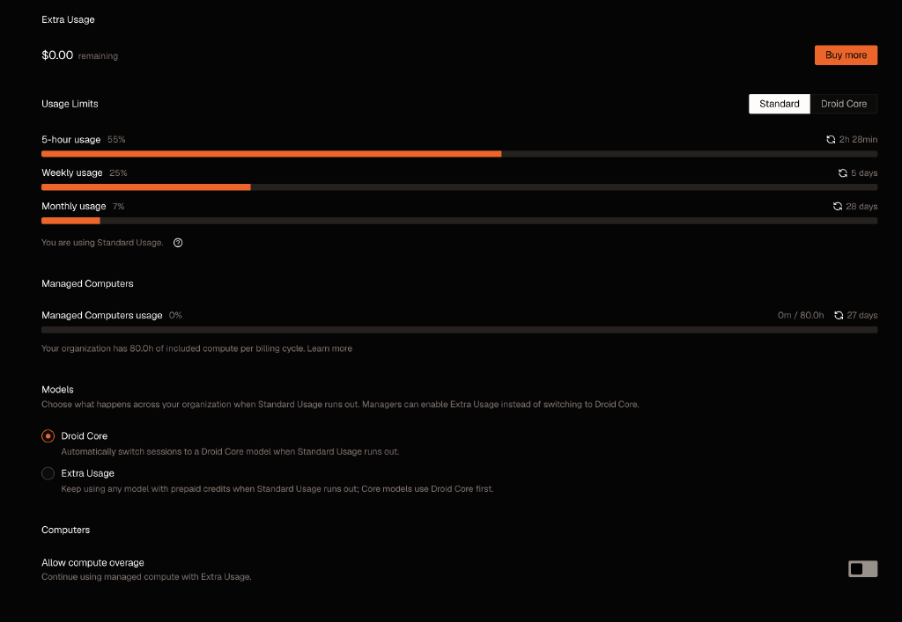

# A Busy Stretch in Factory, With a Usage Blind Spot

- Surface: Factory App and GitHub, across Filed & Forgotten, VirelaiOS, and this site
- Date: 2026-09-28
- Evidence: [filed.fyi front-page PR #580](https://github.com/drawmeanelephant/filed.fyi/pull/580), [lorelog issues #561–#575](https://github.com/drawmeanelephant/filed.fyi/issues/561), recent VirelaiOS PRs [#1830](https://github.com/drawmeanelephant/VirelaiOS/pull/1830), [#1831](https://github.com/drawmeanelephant/VirelaiOS/pull/1831), [#1832](https://github.com/drawmeanelephant/VirelaiOS/pull/1832), and [#1833](https://github.com/drawmeanelephant/VirelaiOS/pull/1833), plus the usage snapshot below. A Factory issue was also filed; its reference wasn't in the notes I could verify.
- Verdict: keep

This has been a good, messy stretch of Factory work: not one giant feature, but several useful threads crossing a few repos.

On Filed & Forgotten, the front page got a structural and CSS pass. PR #580 carries the work: a front-page-specific layout, a navigation drawer that no longer opens over the hero on small screens, and a more coherent type and spacing system with a narrower reading measure. The session also tightened accessibility, contrast, and the minimum type size. It is a real change with a reviewable diff, not just “I asked for a redesign.”

In parallel, I used Nemotron to revisit older lorelog records and look for seams worth strengthening. That pass turned into fifteen actionable GitHub issues, #561–#575: sibling navigation failures, links between the SOMA/COMA incidents, character arcs, and recurring motifs that had been sitting near each other without enough connective tissue. The useful part was not just “add links”; it was getting a set of specific relationships into the issue tracker so each one can be checked and handled on its own.

VirelaiOS has been busy too. Recent merged work ranges from the seat-hosted notification center and persistent keyboard layouts to opt-in remote display and sixel image decoding with cell-native placement. The image path is a nice example of the project’s usual rhythm: define the seam, build the decoder, then prove placement in the running system. These are repo-history receipts, not a claim that one session did all of it.

This blog got a small redesign in the middle of all that. The old site was wearing a borrowed theme; the new Manila theme gives it a filing-record look of its own. It's a light pass, not a grand rebrand, which is fine. It also fixed a small but obvious mistake in the workflow SVG: both straight arrowheads pointed backward. They now follow the lines from me to droid to prod, while the return arrow still comes back to me. There, much less confusing.

## What the usage page tells me

The screenshot is a set of plan meters, not a model-by-model usage report. At the time of capture it showed:

- Standard usage selected; 5-hour usage at 55%, with 2h 28m until reset.
- Weekly usage at 25%, with 5 days until reset.
- Monthly usage at 7%, with 28 days until reset.
- Extra Usage at $0.00 remaining.
- Managed Computers at 0m of 80.0h, with 27 days left in the cycle.
- Droid Core selected as the fallback when Standard Usage runs out.

I still don't see a per-model breakdown here. Session metadata names Nemotron 3 Ultra for the lorelog pass and Claude Opus 5.5 for the Filed front-page pass, but that's session provenance, not an account-level usage report. It doesn't say what share of these meters each model used, especially when routing can vary. I won't turn those labels into made-up model totals or cost estimates.

That gap is part of the story. The work is spread across product, archive, and OS projects; the usage page gives me the broad limits, but not enough detail to say which models carried which share. For now, this is a snapshot of what I can actually see, not an accounting report.
